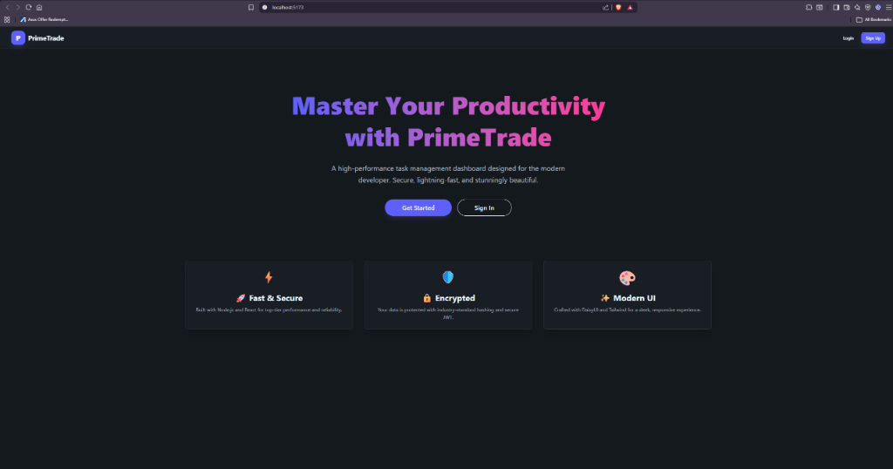
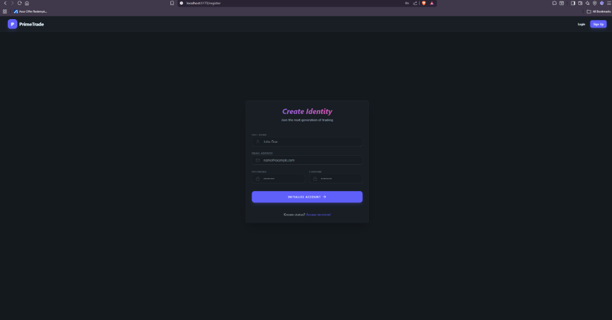
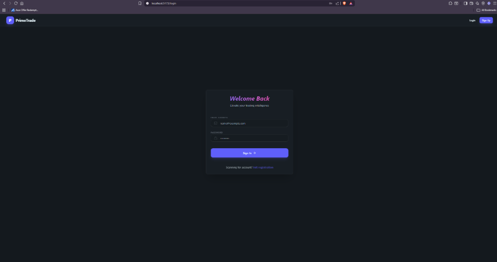
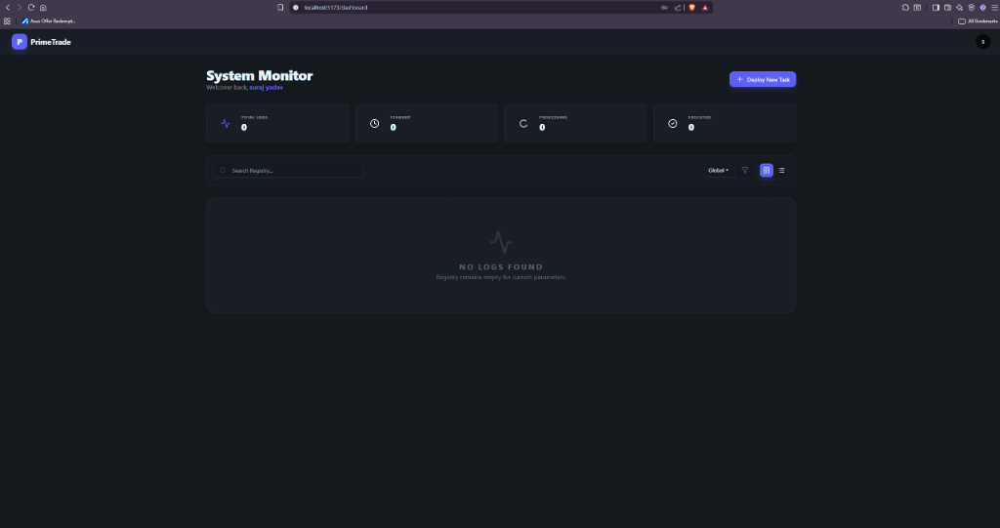
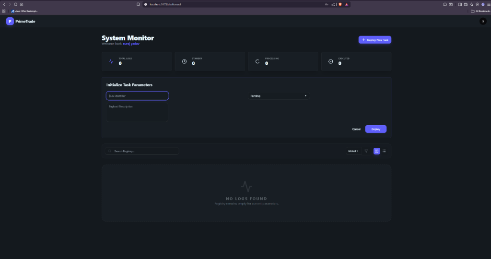

# PrimeTrade Intern Assessment - Scalable Web App

This is a modern, scalable web application built as part of the Frontend Developer Intern assignment. It features a full-stack architecture with a React frontend and Node.js/Express backend.

## 🚀 Features

- **Authentication**: Secure JWT-based signup and login with password hashing.
- **Dashboard**: Interactive dashboard with CRUD operations for Tasks.
- **Filtering**: Search and filter tasks by status.
- **Design**: Premium Glassmorphism UI using Vanilla CSS and React.
- **Security**: Protected routes, HTTP-only practices ready.

## 🛠️ Tech Stack

- **Frontend**: React (Vite), Vanilla CSS (Glassmorphism), Axios, Lucide-React.
- **Backend**: Node.js, Express, MongoDB (Mongoose), JWT, Bcrypt.

## 📦 Installation & Setup

### Prerequisites
- Node.js installed
- MongoDB installed and running locally on port 27017 (or update `server/.env`)

### 1. Setup Backend
```bash
cd server
npm install
npm run dev
```
The server will start on http://localhost:5000

### 2. Setup Frontend
```bash
cd client
npm install
npm run dev
```
The client will start on http://localhost:5173

## 📝 API Documentation

### Auth
- `POST /api/auth/register` - { name, email, password }
- `POST /api/auth/login` - { email, password }
- `GET /api/auth/user` - Get current user (Requires Token)

### Tasks
- `GET /api/tasks` - Get all tasks
- `POST /api/tasks` - { title, description, status }
- `PUT /api/tasks/:id` - Update task
- `DELETE /api/tasks/:id` - Delete task

## 🏗️ Scalability Notes
- **Folder Structure**: Separation of concerns (Routes, Controllers, Models).
- **Component Architecture**: Reusable UI components (TaskCard, Navbar).
- **Context API**: Centralized state management for Auth.
- **Environment config**: Ready for cloud deployment.
## 🖼️ Output Screenshots

### Landing Page


### Authentication
| Register | Login |
| :---: | :---: |
|  |  |

### Dashboard & Task Management
| Dashboard (Empty) | Task Creation |
| :---: | :---: |
|  |  |

## 📜 Logs

Terminal logs are captured in the `logs/` directory:
- `logs/combined.log`: All system and application logs.

To run with logging enabled (PowerShell):
```powershell
npm run dev | Tee-Object -FilePath "../logs/combined.log" -Append
```

# Primetrade.ai--Frontend-Developer-Intern-Task

